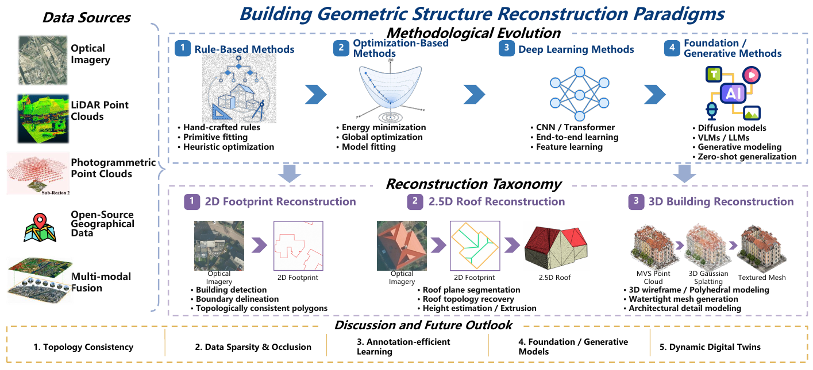
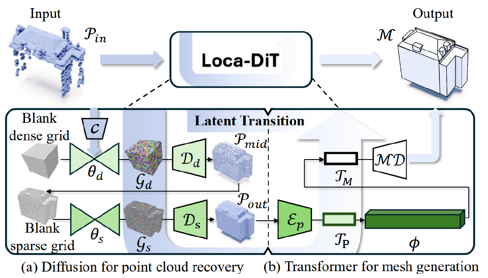

# Automatic Geometric Structure Reconstruction of Buildings from Remote Sensing Data

### A Comprehensive Survey

**Wufan Zhao · Tengxi Wang · Shuai Zhang · Tongyan Hua · Zhuoxiao Li · Claudio Persello · Rongjun Qin**

*Photogrammetric Engineering & Remote Sensing (PE&RS)*

**2D footprints &nbsp; / &nbsp; 2.5D roofs &nbsp; / &nbsp; 3D buildings**

[Overview](#overview) &nbsp; · &nbsp; [Section Summaries](docs/section-summaries.md) &nbsp; · &nbsp; [Paper Library](PAPERS.md) &nbsp; · &nbsp; [Datasets & Evaluation](docs/datasets-and-evaluation.md)

  

Figure 1 from the survey. From remote sensing observations to structured building geometry.

> **Central question:** How can remote sensing observations be converted into building models that are geometrically accurate, topologically consistent, and compact enough to use?

## Overview

Buildings are more than foreground pixels. Urban mapping, simulation, and digital twins require explicit boundaries, connected roof structures, and usable 3D geometry. This survey examines the transition from raster segmentation and handcrafted fitting to direct vector prediction, graph reasoning, and generative reconstruction.

The literature is organized along two complementary axes: **the geometry to be reconstructed** and **the evidence provided by the sensor**. Across these axes, the recurring challenge is to balance measured detail, architectural regularity, and structural completeness.

| Geometry | What is reconstructed? | What makes it difficult? |
| :--- | :--- | :--- |
| **2D** | Closed footprint polygons with ordered corners and clean boundaries | Boundary localization, instance separation, and valid polygon topology |
| **2.5D** | Roof facets, ridges, junctions, and elevation | Recovering both height and the relationships between roof planes |
| **3D** | Building wireframes, polyhedral surfaces, and meshes | Facade completion, surface closure, connectivity, and compactness |

**Reading map**

[1. Introduction](#1-introduction) · [2. 2D Outlines](#2-2d-building-outline-reconstruction) · [3. 2.5D Roofs](#3-25d-building-roof-reconstruction) · [4. 3D Models](#4-3d-building-model-and-wireframe-reconstruction) · [5. Datasets & Evaluation](#5-datasets-and-evaluation) · [6. Future Outlook](#6-discussion-and-future-outlook) · [7. Conclusion](#7-conclusion)

## 1. Introduction

The opening section motivates a shift from recognizing buildings to reconstructing their geometric structure. It defines the progression from planar outlines to roofs and full 3D models, and explains why an output-centered taxonomy is useful for urban applications.

Optical imagery contributes appearance and boundary cues; stereo imagery adds geometry through correspondence; LiDAR supplies direct spatial measurements. These differences determine where a method must rely on observation, regularization, or learned priors. The survey also positions model-driven, data-driven, and hybrid approaches within this common framework.

The review describes a literature search across Web of Science, Scopus, IEEE Xplore, and Google Scholar, primarily covering 2000-2026. Its core scope is explicit building geometry, supplemented by relevant background and supporting methods; semantic classification or raster segmentation alone is not the target output.

**Takeaway:** Select a reconstruction strategy by the required output and available geometric evidence, not by architecture alone.

[Detailed summary](docs/section-summaries.md#s1) · [Background literature](PAPERS.md#background)

## 2. 2D Building Outline Reconstruction

The objective is a clean, valid polygon for each building. Optical methods increasingly predict vertices and connectivity directly, while LiDAR methods recover continuous outlines from irregular point distributions.

| Route | Core idea | Representative studies |
| :--- | :--- | :--- |
| Segmentation and polygonization | Add directional or boundary supervision before vectorization | [Frame Field Learning](https://ieeexplore.ieee.org/document/9577910/), [Tareke et al.](https://ieeexplore.ieee.org/document/10282644/) |
| Sequential prediction | Generate an ordered sequence of corners | [PolyMapper](https://ieeexplore.ieee.org/document/9008272/), [Zhao et al., 2021](https://linkinghub.elsevier.com/retrieve/pii/S0924271621000551), [VectorLLM](https://linkinghub.elsevier.com/retrieve/pii/S0924271626000250) |
| Graphs and matching | Detect corners and infer their connections | [PolyWorld](https://ieeexplore.ieee.org/document/9880425/), [Re:PolyWorld](https://ieeexplore.ieee.org/document/10377491/), [ABCNet](https://linkinghub.elsevier.com/retrieve/pii/S1569843225007186) |
| RoI and query architectures | Predict and refine instance polygons in parallel | [PolyR-CNN](https://linkinghub.elsevier.com/retrieve/pii/S0924271624003824), [RoIPoly](https://linkinghub.elsevier.com/retrieve/pii/S0924271625001364), [PolyBuilding](https://linkinghub.elsevier.com/retrieve/pii/S0924271623000813), [PolyBuild](https://ieeexplore.ieee.org/document/10988661/) |
| Hybrid and hierarchical methods | Couple geometric supervision, tracing, or contour optimization | [HiSup](https://linkinghub.elsevier.com/retrieve/pii/S0924271623000667), [BD-Tracing](https://ieeexplore.ieee.org/document/10285447/), [GCP](https://ieeexplore.ieee.org/document/11172367/) |
| LiDAR tracing and regularization | Trace projected points and enforce geometric consistency | [RMBR](https://linkinghub.elsevier.com/retrieve/pii/S0924271613002256), [GMDL](https://www.isprs.org/proceedings/XXXVII/congress/3_pdf/11.pdf), [ATAS](https://linkinghub.elsevier.com/retrieve/pii/S0926580524000578) |
| LiDAR feature fusion | Separate building points using point geometry and grid texture before outlining | [Du et al., 2017](https://linkinghub.elsevier.com/retrieve/pii/S0924271616306438) |

**Takeaway:** Good segmentation scores do not, by themselves, establish polygon quality. Sharp corners, sensible vertex counts, and correct connectivity must also be assessed.

<strong>What each subsection covers</strong>

- **2.1 Optical imagery:** segmentation-based methods; sequential, graph-based, query-based, and hybrid vector generation; their different failure modes.
- **2.2 LiDAR point clouds:** local tracing, global regularization, adaptive boundaries, and point/grid feature fusion.
- **2.3 Synthesis:** the trade-off between preserving observed boundary detail and enforcing architectural regularity.

[Detailed summary](docs/section-summaries.md#s2) · [2D paper collection](PAPERS.md#footprints)

## 3. 2.5D Building Roof Reconstruction

Roof reconstruction adds elevation and internal structure to the building outline. A useful representation must recover roof facets and their adjacency, including ridges, valleys, and height discontinuities.

| Route | Core idea | Representative studies |
| :--- | :--- | :--- |
| Image-based primitive parsing | Detect junctions and edges, then reason about roof graphs | [HEAT](https://ieeexplore.ieee.org/document/9878511/), [Conv-MPN](https://ieeexplore.ieee.org/document/9156819/), [RSGNN](https://linkinghub.elsevier.com/retrieve/pii/S092427162200065X), [Roof-Former](https://ieeexplore.ieee.org/document/10282198/) |
| Plane and height inference | Infer plane parameters, roof sections, or height from imagery | [PlaneRCNN](https://ieeexplore.ieee.org/document/8953257/), [Boundary-aware reconstruction](https://ieeexplore.ieee.org/document/9156304/), [KIBS](https://linkinghub.elsevier.com/retrieve/pii/S0924271624004210) |
| Model-driven LiDAR reconstruction | Fit templates or discover shared geometric regularities | [RMBR](https://linkinghub.elsevier.com/retrieve/pii/S0924271613002256), [Global regularities](https://ieeexplore.ieee.org/document/6247692/) |
| Data-driven LiDAR reconstruction | Assemble planes or learn roof vertices and edges | [Cycle graph analysis](https://linkinghub.elsevier.com/retrieve/pii/S0924271614001129), [Point2Roof](https://linkinghub.elsevier.com/retrieve/pii/S0924271622002362), [RR-Net](https://ieeexplore.ieee.org/document/11218167/) |

**Takeaway:** A correct roof graph and an accurate roof surface are related but distinct achievements. Topology must be paired with reliable elevation.

<strong>What each subsection covers</strong>

- **3.1 Optical imagery:** primitive graphs, segmentation-guided vectorization, direct plane estimation, and learned height cues.
- **3.2 LiDAR point clouds:** top-down templates and global priors versus bottom-up plane extraction, graph assembly, and learned edge prediction.
- **3.3 Synthesis:** roof models need metric accuracy and structural consistency, particularly for complex roof configurations.

[Detailed summary](docs/section-summaries.md#s3) · [Roof paper collection](PAPERS.md#roofs)

## 4. 3D Building Model and Wireframe Reconstruction

Full 3D reconstruction must organize vertices, edges, and faces into a coherent building representation. The section compares image-derived geometry, directly measured point clouds, and their fusion, while distinguishing structural reconstruction from plausible scene generation.

| Evidence / representation | Reconstruction strategy | Representative studies |
| :--- | :--- | :--- |
| Stereo imagery and DSMs | Recover depth, then fit or assemble structured surfaces | [SAT2LOD2](https://isprs-archives.copernicus.org/articles/XLIII-B2-2022/379/2022/), [PLANES4LOD2](https://linkinghub.elsevier.com/retrieve/pii/S0924271624001758) |
| Single-image structural inference | Infer wireframes or roof-footprint geometry and height under structural priors | [3D Manhattan wireframes](https://ieeexplore.ieee.org/document/9010693/), [DG-BRF](https://linkinghub.elsevier.com/retrieve/pii/S0924271625004563) |
| City-scale generative modeling | Generate urban geometry conditioned on a height-field representation | [Sat2City](https://ieeexplore.ieee.org/document/11446050/) |
| Primitive assembly | Select and regularize candidate planes and faces | [PolyFit](https://ieeexplore.ieee.org/document/8237520/), [City3D](https://www.mdpi.com/2072-4292/14/9/2254), [SimpliCity](https://ieeexplore.ieee.org/document/10678009/) |
| Learned wireframes and meshes | Predict edges, autoregressive meshes, or implicit fields | [PBWR](https://ieeexplore.ieee.org/document/10656530/), [Point2Building](https://linkinghub.elsevier.com/retrieve/pii/S092427162400279X), [Deep implicit fields](https://linkinghub.elsevier.com/retrieve/pii/S0924271622002611) |
| Diffusion-assisted structure | Generate edges or recover points before mesh generation | [EdgeDiff](https://ieeexplore.ieee.org/document/11094351/), [BuildAnyPoint](https://openaccess.thecvf.com/content/CVPR2026/html/Hua_BuildAnyPoint_3D_Building_Structured_Abstraction_from_Diverse_Point_Clouds_CVPR_2026_paper.html) |
| Architectural programs | Generate editable procedural structure and derive a compact mesh | [ArcPro](https://ieeexplore.ieee.org/document/11092796/) |
| Image-LiDAR fusion | Combine sharp visual boundaries with metric surface measurements | [Cheng et al., 2011](https://doi.org/10.14358/pers.77.2.125), [Cheng et al., 2013](https://linkinghub.elsevier.com/retrieve/pii/S0143816612002990), [Awrangjeb et al.](https://linkinghub.elsevier.com/retrieve/pii/S0924271613001342) |

<strong>Example: from heterogeneous point clouds to a structured mesh</strong>

*Figure 7 from the survey, presenting BuildAnyPoint (Hua et al., 2026). The method recovers an intermediate point representation before conditional mesh generation.*

**Takeaway:** Geometric fidelity, structural completeness, and model compactness must be considered together. A visually plausible completion still needs validation against the observations.

[Detailed summary](docs/section-summaries.md#s4) · [3D paper collection](PAPERS.md#models) · [Fusion studies](PAPERS.md#fusion)

## 5. Datasets and Evaluation

Training and evaluation must reflect the intended geometric output. Footprint masks, roof graphs, and building meshes supply different supervision and support different claims about reconstruction quality.

| Task | Representative resources | Evaluation emphasis |
| :--- | :--- | :--- |
| Building footprints | CrowdAI, WHU, Inria, SpaceNet, Deventer-512 | Instance coverage, polygon boundaries, corners, and complexity |
| Roof structure | VWB, Enschede, Roof3D, Boston / BONAI | Junctions, edge connectivity, roof facets, and height |
| 3D reconstruction and supporting tasks | BuildingWF, BuildingWorld, Building3D, Map2ImLas, City-BIS, Structured3D | Surface fit, wireframes, topology, and structural completeness |

The survey discusses region and instance metrics, boundary measures such as PoLiS, angle and complexity measures, edge precision/recall, and 3D geometric errors. Segmentation or semantic datasets can support a reconstruction pipeline without providing a complete reconstruction benchmark.

**Takeaway:** Report geometric quality and topology alongside coverage. Results from different datasets, input conditions, and evaluation protocols should not be treated as a single leaderboard.

[Dataset and metric guide](docs/datasets-and-evaluation.md) · [Detailed summary](docs/section-summaries.md#s5)

## 6. Discussion and Future Outlook

| Research direction | Opportunity | Open question |
| :--- | :--- | :--- |
| Topology and geometric regularity | Recover usable polygons, wireframes, and surfaces | How can valid structure be enforced without erasing real architectural detail? |
| Sparse and occluded observations | Combine measurements with structural completion | Which parts are measured, and which are inferred? |
| Annotation-efficient learning | Use self-supervision and aligned geographic data | How can noisy pseudo-labels and geographic domain shifts be controlled? |
| Foundation and generative models | Transfer semantic knowledge and learned shape priors | How can coordinate accuracy, topology, and uncertainty be validated? |
| Neural scene representations | Use NeRF and 3D Gaussian Splatting for appearance and surface recovery | How can continuous fields or Gaussians yield explicit, connected building geometry? |
| Multimodal and semantic modeling | Connect appearance, geometry, and urban meaning | How can alignment and temporal inconsistencies be managed? |
| Agent-assisted workflows | Coordinate preprocessing, reconstruction tools, and quality control | How can tool constraints, intermediate validation, and human oversight prevent cascading errors? |
| Scalable, dynamic digital twins | Update city models through time | How can efficiency, provenance, and reliable change tracking be maintained? |

**Takeaway:** The next step is dependable reconstruction at urban scale. New model families are promising, but reliable deployment also requires geometric checks, uncertainty awareness, and reproducible workflows.

[Detailed summary](docs/section-summaries.md#s6) · [Outlook literature](PAPERS.md#outlook)

## 7. Conclusion

Building reconstruction is progressing from masks and isolated primitives toward explicit, connected geometric representations. Optical imagery, LiDAR, and multimodal fusion provide complementary evidence, while learned methods expand the range of structures that can be recovered.

The survey's central conclusion is that automation must be judged by the usability of the resulting geometry. Accurate observations, appropriate structural priors, topology-aware modeling, and scalable processing remain essential for building dependable urban digital twins. Generative models, semantic enrichment through standards such as CityGML, and temporal updating are promising directions, not established guarantees of metric accuracy or generalization.

[Detailed summary](docs/section-summaries.md#s7)

---

## Paper Library and Links

The [paper library](PAPERS.md) contains **110 bibliography entries**, including the original manuscript bibliography and the maintainer-supplied addition, organized into reading collections with stable reference IDs.

Each entry links to its **official publication page, conference record, preprint, or university repository**. Full-text availability and access conditions are determined by the source.

## Publication and Citation
